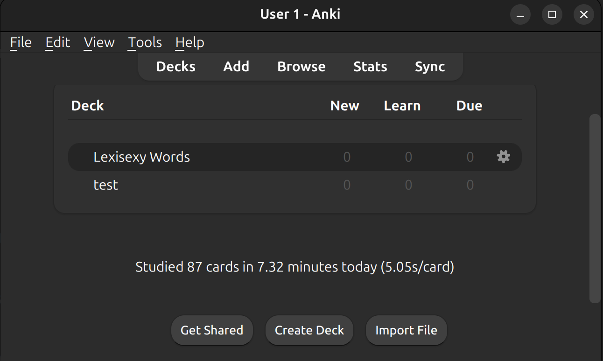

# Lexisexy

I'm learning English by watching movies, but constantly pausing to look up unfamiliar words breaks the experience. So the idea came to me: extract the vocabulary from a movie's subtitles beforehand, learn the important words at my level, then watch with confidence.
Lexisexy does exactly that — it reads **PDF** and **SRT** files, filters words by **CEFR** level, translates them into your language, and exports everything to **CSV, HTML, PDF, or Anki flashcard decks** with pronunciation audio and images.



## Installation

Clone the repository and navigate to the project folder.

```bash
git clone https://github.com/mo1ein/lexisexy.git
cd lexisexy
uv run main.py
```

### Anki Setup (for flashcard export)

To export words as Anki flashcards with pronunciation audio, you need:

1. **Install Anki** — the spaced-repetition flashcard app:

   ```bash
   # Ubuntu/Debian
   sudo apt install anki

   # macOS (via Homebrew)
   brew install --cask anki

   # Windows: download from https://apps.ankiweb.net/
   ```

2. **Install mplayer** — required for Anki to play pronunciation audio:

   ```bash
   # Ubuntu/Debian
   sudo apt install mplayer

   # macOS (via Homebrew)
   brew install mplayer

   # Windows: download from http://www.mplayerhq.hu/
   ```

   > **Note:** Without mplayer, audio pronunciation will not play in Anki cards.

## Usage

Basic command — extract words from an SRT file, filter by B2 level, translate to Persian (default), and export to Anki:

```bash
uv run main.py -i movie.srt -s stop_words.txt -c cefr.csv -l B2 --anki
```

Examples:

- Extract all words from a PDF with no translation, export to CSV:

```bash
uv run main.py -i report.pdf --csv words.csv
```

- Extract B1 words from an SRT file, translate to German, and export to PDF:

```bash
uv run main.py -i movie.srt -c cefr.csv -l B1 --lang de --pdf b1_words.pdf
```

- Export to Anki with pronunciation audio and images:

```bash
uv run main.py -i movie.srt -c cefr.csv -l B2 --anki words.apkg
```

- Export to Anki without downloading media (faster, no audio/images):

```bash
uv run main.py -i movie.srt -c cefr.csv -l B2 --anki words.apkg --no-media
```

- Export to HTML with pronunciation play buttons and images:

```bash
uv run main.py -i book.pdf -c cefr.csv -l A2 --html words.html
```

- Use a CEFR CSV from a GitHub raw URL:

```bash
uv run main.py -i book.pdf -c https://raw.githubusercontent.com/.../cefr.csv -l A2 --html a2_words.html
```

- Extract words from specific pages of a PDF (single page, comma-separated, or ranges):

```bash
uv run main.py -i book.pdf -c cefr.csv -l B1 --pages 10 --csv page10.csv
uv run main.py -i book.pdf -c cefr.csv -l B1 --pages 10,20,30 --csv pages.csv
uv run main.py -i book.pdf -c cefr.csv -l B1 --pages 1-5,50 --anki pages.apkg
```

## Anki Flashcards

When exporting with `--anki`, each flashcard includes:

- **Front:** The English word
- **Back:** Translation, pronunciation audio (auto-play), and an image of the word

Pronunciation audio is sourced from Wikimedia Commons (native recordings) with Google TTS as fallback. Images come from Wiktionary, Wikipedia, and Wikimedia Commons.

Media is cached in `.media_cache/` — subsequent runs with the same words are instant.

After generating the `.apkg` file, you can import it into Anki from the bottom with *Import files*.




## Stopwords

Provide a plain-text file with one stopword per line (or space-separated). Example:

```text
the
and
to
of
a
```

A default `stop_words.txt` is included in the repository. Use it if you don't have your own.
If the file is missing, the script will warn you and continue with an empty stopword list.
